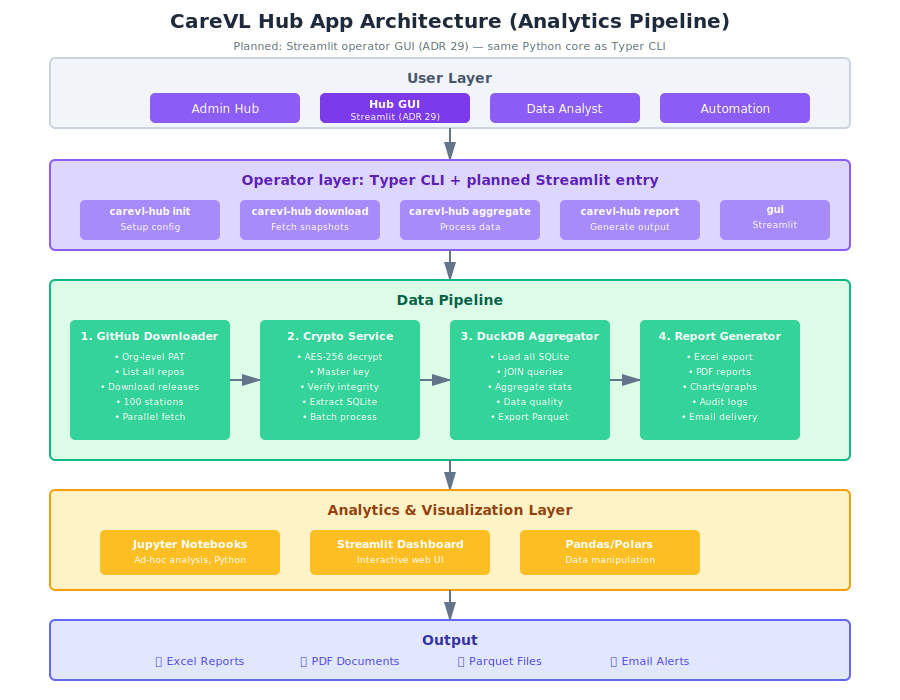

# Two-App Architecture: Edge vs Hub

## Status
[Active - Planned]

## Context
CareVL co hai nhom user rat khac:
1. Edge/Tram: operator, bac si, lab tech, truong tram
2. Hub/Tinh: admin hub, analyst

Neu gom chung mot app:
- code phinh to
- dependency de conflict
- deployment kho
- security risk cao vi Hub co quyen lon

## Decision
Phat trien `2 app` trong `1 monorepo`.

### CareVL Edge
Muc dich: quan ly du lieu tai tram

Stack:
- FastAPI
- SQLite
- HTMX + Alpine.js + TailwindCSS
- PyInstaller

Feature:
- Kich hoat tram lan dau (Invite Code: du lieu + PIN)
- 10 chuc nang sidebar
- Active Sync upload snapshot len GitHub Releases
- Offline-first, PIN authentication

Deployment:
- Windows `.exe`
- Chay local tai tram
- Khong can internet tru khi sync

Vi tri de xuat: `edge/`

### CareVL Hub
Muc dich: tong hop va phan tich du lieu tu tat ca tram

Stack:
- Python CLI (`typer`) — **nguon that** cho automation / Task Scheduler
- DuckDB, Pandas, Jupyter
- **Streamlit** — GUI van hanh noi bo cho Admin tinh (**ke hoach**, chi tiet [29. Hub Operator GUI (Streamlit)](29_Hub_Operator_Gui_Streamlit.md)); **khong** OAuth GitHub trong browser, PAT qua form / session / secrets local

Feature:
- Download snapshot tu nhieu repo
- Giai ma AES-256
- Aggregate bang DuckDB
- Tao report Excel/PDF/Parquet (dau ra Hub buoc 10 trong `overview_end_to_end.svg`)
- Lien thong batch VNEID / So suc khoe dien tu tu du lieu tong hop (dau ra Hub buoc 11; ke hoach, tach bach voi bao cao tinh)
- Data quality checks
- Audit logs
- **(Planned)** Operator GUI: `carevl-hub gui` → Streamlit localhost, goi cung core Python voi CLI

Deployment:
- Python package
- Chay tren may Admin Hub
- Can internet de keo snapshot
- **(Planned)** GUI: chi `127.0.0.1` mac dinh; khong mo WAN thieu proxy + auth

Vi tri de xuat: `hub/`

Auth Hub:
- Dung GitHub Classic PAT cua owner de access tat ca repo
- Hoac GitHub App neu chi doc release trong org
- GUI: PAT nhap trong session Streamlit hoac `.streamlit/secrets.toml` — khong commit

### So do
He sinh thai:
- Edge app moi tram upload snapshot len GitHub Releases
- Hub app download tat ca snapshot de aggregate
- Sau aggregate, **hai nhanh dau ra** chuan: bao cao cap tinh (10) va lien thong batch VNEID/SKDT (11) — xem [26. Visualization Catalog](26_Visualization.md) / `overview_end_to_end.svg`
- Khong co real-time sync; chi pull khi can

Anh kien truc:
- 
- 

### Monorepo de xuat
```text
carevl/
|- edge/
|- hub/
|- shared/
|- scripts/
|- AGENTS/
|- config/
|- data/
|- legacy/
|- .github/
```

Chi tiet:
- `edge/app/`: routes, core, models, services, templates, static
- `hub/carevl_hub/`: `cli.py`, `admin.py`, `downloader.py`, … (pipeline); **`gui/`** (ke hoach) — `app.py` Streamlit, goi service chung voi CLI
- `shared/`: `crypto.py`, `models.py`, `constants.py`

### Dependencies
Edge:
- `fastapi`
- `sqlalchemy`
- `cryptography`
- `httpx`
- `jinja2`
- `uvicorn`

Hub:
- `typer`
- `duckdb`
- `pandas`
- `httpx`
- `cryptography`
- `openpyxl`
- `streamlit` tuy chon

Shared:
- `cryptography`
- `pydantic`

### CLI Hub de xuat
```bash
uv run carevl-hub init --encryption-key "xxx"
uv run carevl-hub download --date 2026-04-28
uv run carevl-hub decrypt --input snapshots/ --output decrypted/
uv run carevl-hub aggregate --output hub_report.parquet
uv run carevl-hub report --format excel --output monthly_report.xlsx
uv run carevl-hub dashboard --port 8080   # TODO / legacy stub
# (Planned — ADR 29) GUI van hanh:
uv run carevl-hub gui   # → streamlit run … localhost
```

### Workflow dev
Edge:
```bash
cd edge
uv sync
uv run uvicorn app.main:app --reload
uv run pytest
```

Build Edge:
```bash
uv run pyinstaller edge/carevl.spec
```

Hub:
```bash
cd hub
uv sync
uv run python -m carevl_hub.cli --help
uv pip install -e .
uv run pytest
```

Shared code:
```python
from shared.crypto import encrypt_snapshot
from shared.crypto import decrypt_snapshot
```

### Deployment
Edge:
1. Build `carevl.exe`
2. Upload len GitHub Releases cua repo chinh
3. Tram download hoac dung bootstrap

Hub:
1. Package Hub CLI
2. Publish PyPI neu can
3. Admin install
4. Config encryption key va GitHub PAT
5. Chay lenh download, decrypt, aggregate, report
6. **(Planned)** Cai optional `streamlit`, chay `carevl-hub gui` tren may Admin (xem [22](22_Deployment_Guide.md), [29](29_Hub_Operator_Gui_Streamlit.md))

### Tach bao mat
- Edge PAT: chi `1` repo
- Hub PAT: nhieu repo, quyen cao hon
- Edge chi thay `1` tram
- Hub thay tat ca tram
- Edge offline-first; Hub online-required

### Lo trinh migrate
1. Tao `edge/`, `hub/`, `shared/`, `scripts/`
2. Day Edge code vao `edge/`
3. Tach crypto/model dung chung vao `shared/`
4. Dung Hub CLI trong `hub/`
5. Update CI/CD
6. Viet `README` rieng cho Edge va Hub

Next steps:
- [ ] Tao cau truc monorepo
- [ ] Di chuyen Edge code
- [ ] Extract shared crypto
- [ ] Tao Hub CLI voi Typer
- [ ] Implement DuckDB aggregation
- [ ] Setup org-level PAT cho Hub
- [ ] Viet script build
- [ ] Update CI/CD
- [ ] Viet README cho Edge va Hub
- [x] Ve so do Edge
- [x] Ve so do Hub

## Rationale
Monorepo hai app giu code dung chung o `shared/`, giu doc tap trung, va de refactor dong bo Edge/Hub. Cach nay don gian hon microservices, re hon hai repo tach biet, va hop bai toan async qua GitHub Releases.

## Related Documents
- [01. FastAPI Core Architecture](01_FastAPI_Core.md)
- [07. Active Sync Protocol: The Encrypted SQLite Blob](07_active_sync_protocol.md)
- [17. Invite Code Authentication: Fine-grained PAT Provisioning](17_Invite_Code_Authentication.md)
- [15. Hub Aggregation: DuckDB Analytics Pipeline](15_Hub_Aggregation.md)
- [26. Visualization Catalog: SVG, Mermaid & Tables](26_Visualization.md) (E2E buoc 1–11, fork dau ra Hub)
- [29. Hub Operator GUI (Streamlit)](29_Hub_Operator_Gui_Streamlit.md)
