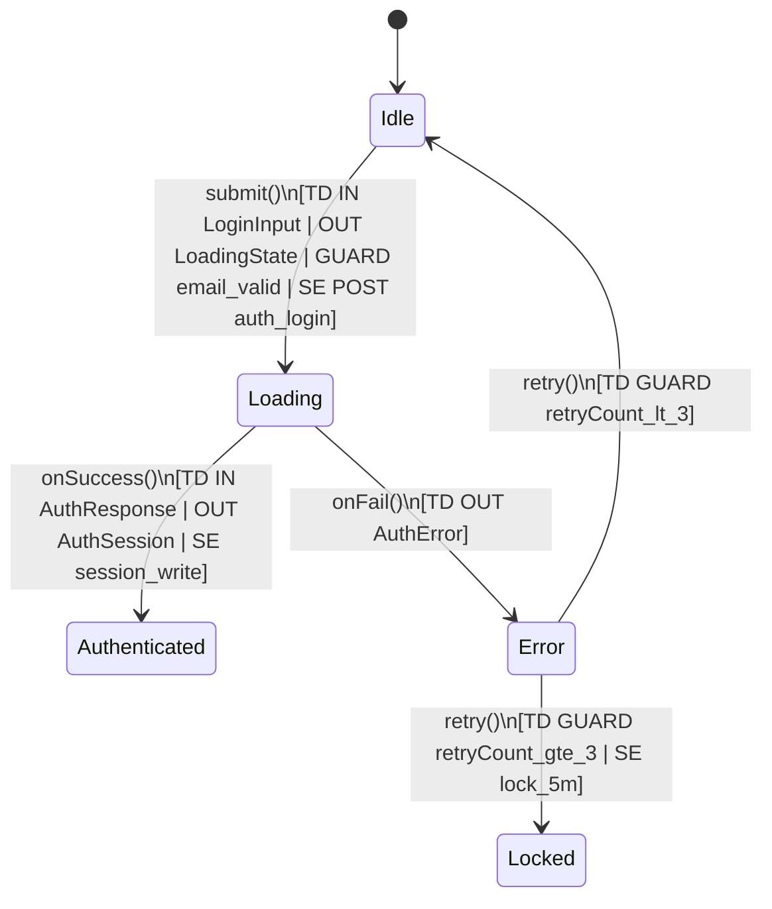

# Verified State Machine Diagramming

## Status
[Active]

## Context
Neu chi doc code roi ve state machine, chung ta chi mo ta "cai dang xay ra" (as-is). Bug thuong nam o khoang cach giua as-is va "cai nen xay ra" (to-be). Team can mot chuan de:
- So state machine voi Acceptance Criteria (AC)
- Bat buoc mo ta Input/Output schema contracts va dataflow transactions tren moi transition
- Sinh gap analysis ro rang va test cases tu so do

## Decision
Ap dung chuan **Verified State Machine** cho cac feature quan trong (auth, sync, intake, queue, aggregate):

1. **AC la truth source**
- Mỗi sơ đồ state machine bat buoc di kem danh sach AC.
- Sơ đồ duoc danh gia theo AC (khong chi theo code implementation).

2. **Transition contracts bat buoc**
- Mỗi transition phai co toi thieu:
  - Input schema
  - Output schema
  - Guard condition
  - Side effects (API call, db write, localStorage/session write, event emit, navigation)

3. **Dataflow transaction trace**
- Mỗi transition quan trong co transaction line:
  - Source state
  - Trigger
  - Data in
  - Validation/guard
  - Data out
  - Side effect targets
- Dung transaction trace de doi chieu consistency giua UI, API, va database.

4. **Gap analysis bat buoc trong deliverable**
- Danh dau transition/state nao cover AC.
- Liet ke AC chua co state/transition tuong ung.
- Liet ke state/transition trong code nhung khong duoc AC cover.

5. **Test generation tu state machine**
- Tu state machine da verify, sinh test matrix:
  - Happy path transitions
  - Guard fail transitions
  - Error/retry/timeout branches
  - AC gap tests (expected fail hoac pending)

### Mermaid convention
Dung `stateDiagram-v2` va annotate contracts ngay tren transition.

**Mac dinh dung `TD` (Transition Details) cho moi transition** de tranh loi parser va de doc:
- `TD` la 1 dong text gom: `IN`, `OUT`, `GUARD`, `SE`
- Tranh dung `{}`, `:`, hoac ky tu dac biet trong label transition.



### Mermaid vs SVG convention
- **Mac dinh dung Mermaid** lam source-of-truth de Agent va dev tools doc/phan tich duoc.
- **Dung SVG lam artifact** de nhung vao tai lieu, slide, hoac chia se cho nguoi doc khong can sua code.
- Khong ve tay SVG truoc. Quy trinh chuan:
  1) Viet va review ban Mermaid
  2) Verify AC + contracts + gap analysis
  3) Export SVG vao `AGENTS/ASSETS/`
  4) Link SVG trong tai lieu lien quan

### Contract schema format
Schema co the dung JSON Schema, Pydantic model, hoac TypeScript type. Toi thieu can chot:
- Truong bat buoc
- Kieu du lieu
- Rang buoc validation quan trong

Vi du:

```json
{
  "LoginInput": {
    "type": "object",
    "required": ["email", "password"],
    "properties": {
      "email": {"type": "string", "format": "email"},
      "password": {"type": "string", "minLength": 8}
    }
  }
}
```

## Rationale
Chuan nay giup:
- Tranh "diagram dep nhung khong dung spec"
- Lo ro gap giua implementation va AC truoc khi bug ra production
- Kiem tra dataflow som (thieu field, sai type, side effect sai cho)
- Tao test tu dong co he thong, giam blind spot

## Delivery Template (Bat buoc)
Moi tai lieu state machine cho feature can co 4 phan:

1. **Acceptance Criteria Source**
- AC1...
- AC2...

2. **Verified State Machine (Mermaid)**
- Co contracts tren transition (IN/OUT/GUARD/SE)

3. **Gap Analysis**
- AC covered
- AC missing
- Extra states/transitions not justified by AC

4. **Test Matrix**
- Transition tests
- Guard fail tests
- AC gap tests

## Prompt Template cho AI
Su dung prompt sau de sinh deliverable chuan:

```text
Day la code component/service [paste].
Day la acceptance criteria [paste].

Hay tao Verified State Machine voi:
1) Mermaid stateDiagram-v2
2) Moi transition phai co:
   - Input schema
   - Output schema
   - Guard condition
   - Side effects
3) Gap analysis:
   - Transition/state nao cover tung AC
   - AC nao chua duoc cover boi code
   - State/transition nao co trong code nhung khong map vao AC
4) Test matrix:
   - Happy path
   - Guard fail
   - Error/retry/timeout
   - AC gap tests
```

## Related Documents
- [16. Testing Guidelines](16_Testing_Guidelines.md)
- [21. API Specification](21_API_Specification.md)
- [23. Authentication Testing Guide](23_Auth_Testing_Guide.md)
