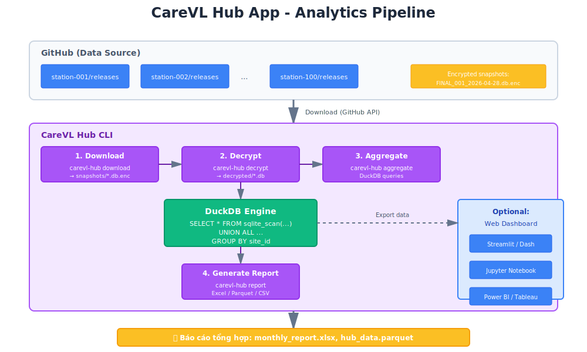
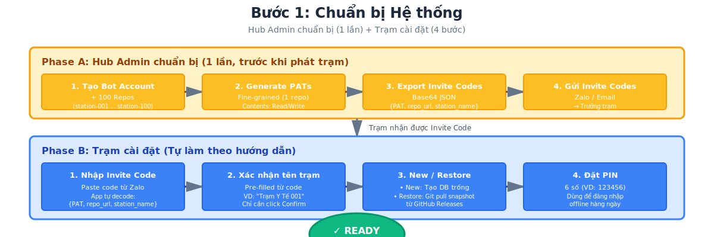
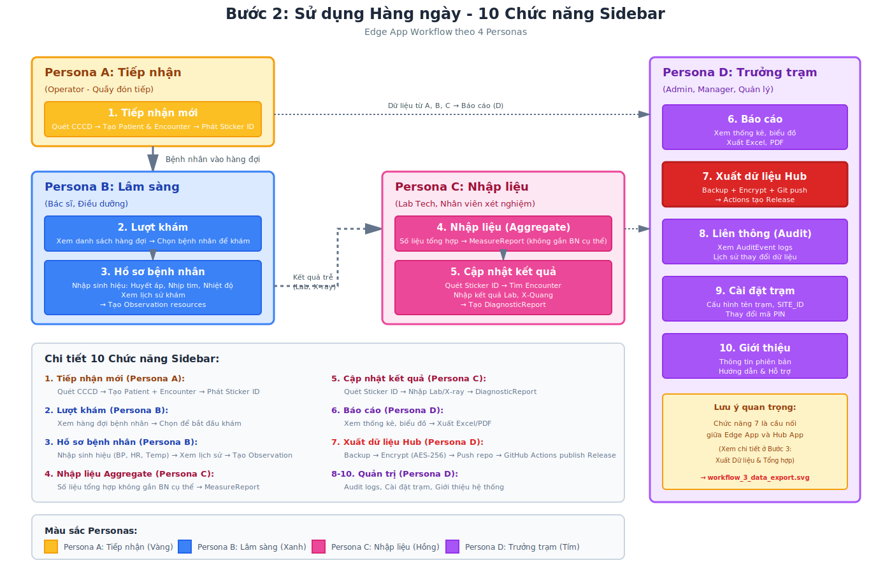
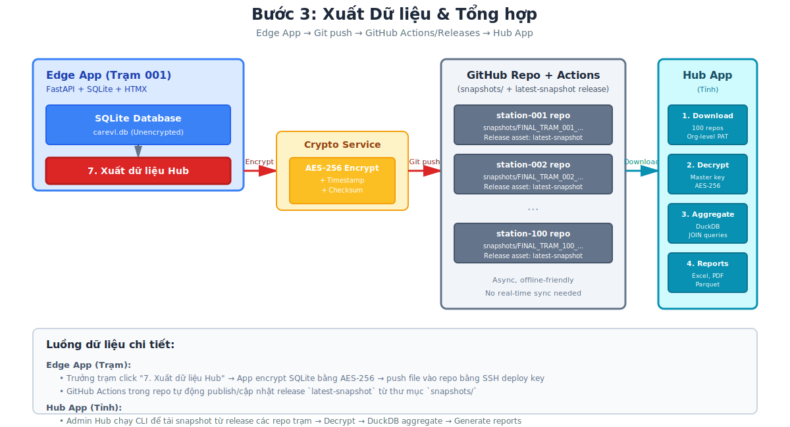
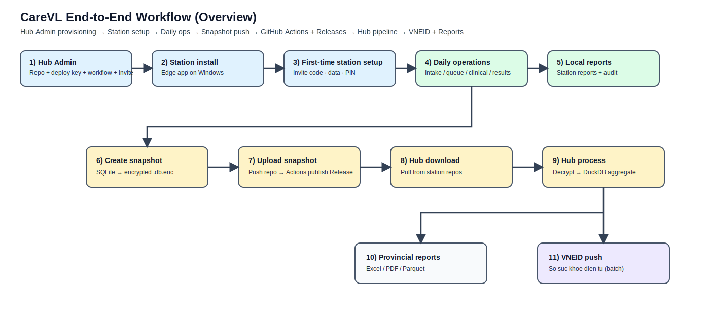
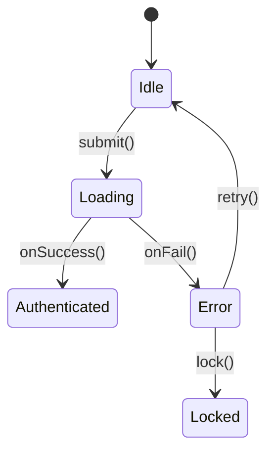
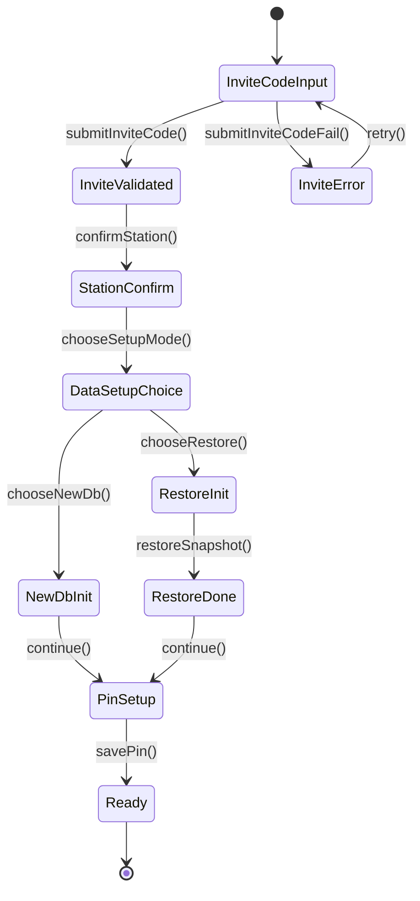

# Visualization Catalog (SVG + Mermaid only)

Ten file trong repo: `AGENTS/ACTIVE/26_Visualization.md` (catalog so do ky thuat; khong dat `.md` o root vi quy tac `AGENTS.md`).

## Status
[Active]

## Context
Can mot file mo len la thay **tat ca so do dang SVG** trong `AGENTS/ASSETS/` va **cac so do Mermaid** (state machine / flow) kem **bang schema + dataflow** ngay ben duoi.

**Anh chup man hinh (mockup PNG)** chi nam trong [TUTORIAL.md](../../TUTORIAL.md), khong lap lai o day.

## Decision
- Phan **SVG**: embed tu `../ASSETS/*.svg` + bang mo ta ngan.
- Phan **Mermaid**: nhung truc tiep trong file nay + bang `Schema Contracts` + `Dataflow Transactions` (mau chuan verified).
- Chi tiet quy uoc ve Mermaid / GitHub render: [24. Verified State Machine Diagramming](24_Verified_State_Machine_Diagramming.md).

## Rationale
Tach ro: catalog ky thuat (vector + mermaid) vs huong dan nguoi dung (screenshot).

## Related Documents
- [24. Verified State Machine Diagramming](24_Verified_State_Machine_Diagramming.md)
- [18. Two-App Architecture: Edge vs Hub](18_Two_App_Architecture.md)
- [TUTORIAL.md](../../TUTORIAL.md)

---

## Architecture & workflow (SVG)

### `edge_app_architecture.svg`

| Thanh phan chinh | Vai tro |
|---|---|
| Edge App (FastAPI + HTMX) | UI + API tai tram |
| Station SQLite | Du lieu offline-first |
| Snapshot .db.enc | Backup / dong bo artifact |
| GitHub Releases | Kenh luu tru snapshot |

---

### `hub_app_architecture.svg`

| Thanh phan chinh | Vai tro |
|---|---|
| Hub CLI | Tai va xu ly snapshot tu nhieu tram |
| Decrypt | Giai ma snapshot |
| DuckDB | Tong hop / truy van |
| Hub Reports | Bao cao tinh |

---

### `hub_app_diagram.svg`

| Thanh phan chinh | Ghi chu |
|---|---|
| Hub pipeline | So do tong quan luong xu ly Hub (CLI / data) |

---

### `workflow_1_preparation.svg`

| Buoc | Muc tieu |
|---|---|
| Hub Admin chuan bi | Repo + PAT + invite |
| Station cai dat | Edge app san sang |
| Gateway | Khoi tao du lieu + PIN |

---

### `workflow_2_daily_usage.svg`

| Nhom | Muc tieu |
|---|---|
| Personas | Tiep nhan / Lam sang / Nhap lieu / Truong tram |
| Sidebar | 10 chuc nang dieu huong |

---

### `workflow_3_data_export.svg`

| Buoc | Muc tieu |
|---|---|
| Snapshot | Dong goi SQLite ma hoa |
| GitHub Releases | Luu tru |
| Hub | Tai + giai ma + tong hop |

---

### `overview_end_to_end.svg`

**Khuon nghiep vu chuan (truth source cho trien khai):** SVG la ban danh so buoc 1–11. Tai lieu khac chi duoc mo ta chi tiet hon hoac lat cat (workflow_1/2/3), **khong duoc** ngam dinh mot luong Hub chi co mot dau ra neu no xung dot voi buoc 10 vs 11.

| Buoc | Muc tieu (tom tat) |
|---|---|
| 1 | Hub Admin: repo + PAT + invite |
| 2 | Cai dat tram (Edge tren Windows) |
| 3 | Gateway: invite / du lieu / PIN |
| 4 | Van hanh hang ngay (tiep nhan, hang doi, lam sang, ket qua) |
| 5 | Bao cao + audit **tai tram** |
| 6 | Tao snapshot: SQLite → `.db.enc` |
| 7 | Upload snapshot (GitHub Releases) |
| 8 | Hub tai snapshot tu cac repo tram |
| 9 | Hub: giai ma → tong hop DuckDB |
| 10 | **Dau ra 1:** bao cao cap tinh (Excel / PDF / Parquet) |
| 11 | **Dau ra 2:** lien thong batch (VNEID / So suc khoe dien tu) — canh bao cao tinh, khong thay the |

Sau buoc 9, luong re **hai nhanh song song** (10 va 11), khong hop nhat thanh mot hop duy nhat trong van ban ky thuat.

---

## Mermaid: verified examples (state machine + tables)

### Example: auth-like flow (mau chuan)

**Schema Contracts**

| Contract | Fields | Rules |
|---|---|---|
| LoginInput | email, password | email format valid, password min length |
| AuthResponse | token, userId | token required |
| AuthSession | token, userId, expiresAt | expiresAt required |
| AuthError | errorCode, message | errorCode required |

**Dataflow Transactions**

| Transition | From | To | Input Contract | Output Contract | Guard | Side Effects |
|---|---|---|---|---|---|---|
| submit() | Idle | Loading | LoginInput | LoadingState | email_valid | POST auth_login |
| onSuccess() | Loading | Authenticated | AuthResponse | AuthSession | response_ok | session_write |
| onFail() | Loading | Error | AuthResponse | AuthError | response_error | emit_error_event |
| retry() | Error | Idle | RetryInput | IdleState | retryCount_lt_3 | clear_error_state |
| lock() | Error | Locked | RetryInput | LockedState | retryCount_gte_3 | lock_5m |

---

### Gateway setup (rut gon)

**Schema Contracts**

| Contract | Fields | Rules |
|---|---|---|
| InviteCodeInput | inviteCode | required, base64 |
| InviteCodeDecoded | stationId, stationName, repoUrl, patRef | all required |
| SetupMode | mode | enum: new, restore |
| RestoreRequest | snapshotTag, encryptionKeyRef | required when mode=restore |
| PinInput | pin6 | required, exactly 6 digits |
| ReadyContext | pinHashRef, authReady | authReady must be true |

**Dataflow Transactions**

| Transition | From | To | Input Contract | Output Contract | Guard | Side Effects |
|---|---|---|---|---|---|---|
| submitInviteCode() | InviteCodeInput | InviteValidated | InviteCodeInput | InviteCodeDecoded | base64_valid_and_required_keys | decode_and_validate |
| submitInviteCodeFail() | InviteCodeInput | InviteError | InviteCodeInput | AuthError | invalid_payload | capture_validation_error |
| confirmStation() | InviteValidated | StationConfirm | InviteCodeDecoded | StationContext | station_fields_present | persist_station_context |
| chooseSetupMode() | StationConfirm | DataSetupChoice | StationContext | SetupMode | setup_mode_selected | - |
| chooseNewDb() | DataSetupChoice | NewDbInit | SetupMode | DbInitStatus | setupMode_is_new | init_empty_sqlite |
| chooseRestore() | DataSetupChoice | RestoreInit | SetupMode | RestoreRequest | setupMode_is_restore | list_snapshot_on_github |
| restoreSnapshot() | RestoreInit | RestoreDone | RestoreRequest | RestoreStatus | snapshot_exists | download_decrypt_import_snapshot |
| continue() | NewDbInit/RestoreDone | PinSetup | DbInitStatus_or_RestoreStatus | PinSetupRequired | init_or_restore_success | - |
| savePin() | PinSetup | Ready | PinInput | ReadyContext | pin_format_valid | secure_store |
| retry() | InviteError | InviteCodeInput | RetryInput | InviteCodeInput | retryCount_allowed | clear_error_state |

---

## Ghi chu cho tac nhan AI

- Mo file nay de quet **SVG + Mermaid + bang**; mockup PNG chi o `TUTORIAL.md`.
- Quy uoc viet Mermaid / tach bang: [24. Verified State Machine Diagramming](24_Verified_State_Machine_Diagramming.md).
