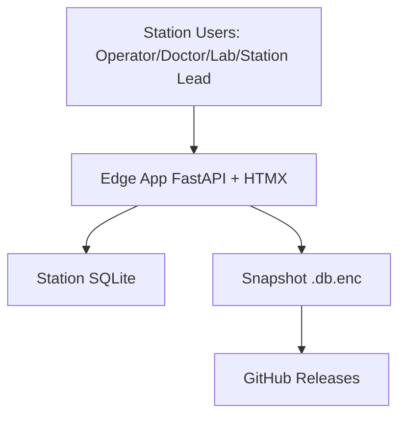
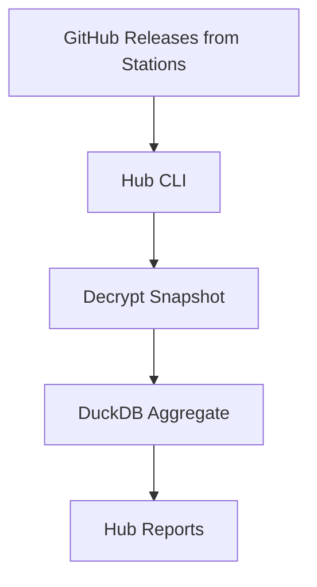
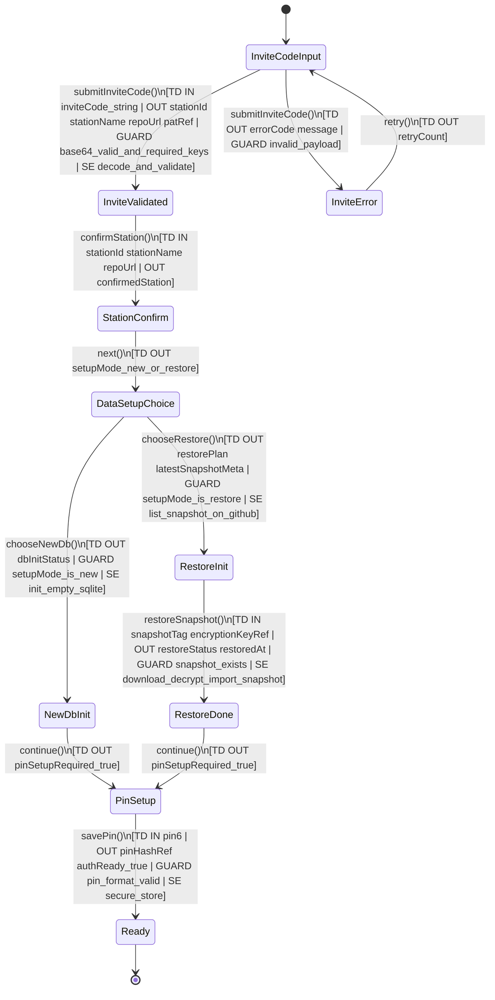
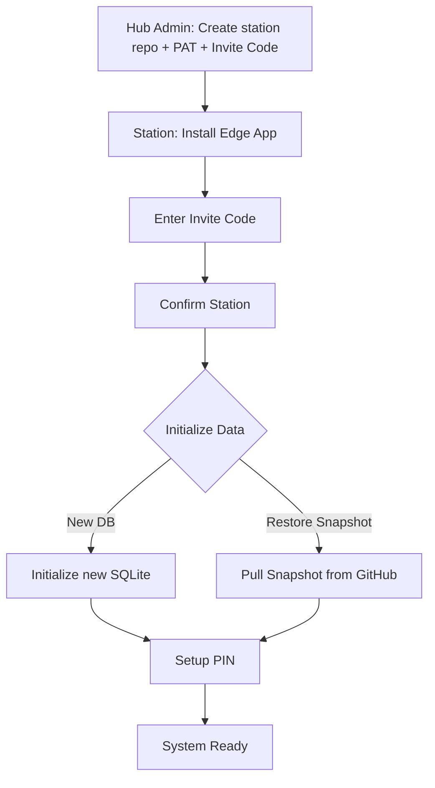
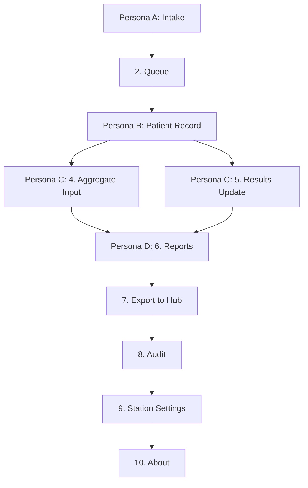
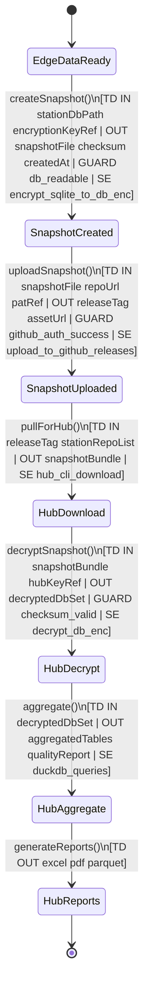

# Sổ tay Vận hành CareVL Edge (Visual Tutorial - Windows Edition)

Tài liệu này hướng dẫn chi tiết quy trình cài đặt và sử dụng **CareVL Edge App** (ứng dụng trạm) dành riêng cho môi trường Windows tại các trạm y tế / đoàn khám lưu động.

> **Lưu ý:** Tài liệu này chỉ dành cho **Edge App** (ứng dụng tại trạm). Nếu bạn là Admin Hub cần tổng hợp dữ liệu từ nhiều trạm, vui lòng xem [Hub App Documentation](AGENTS/ACTIVE/18_Two_App_Architecture.md).

---

## Kiến trúc Hệ thống CareVL

CareVL được thiết kế theo mô hình **Two-App Architecture**:

### Thuật ngữ chuẩn dùng trong tất cả sơ đồ
- **Hub Admin**: quản trị viên cấp tỉnh, chuẩn bị repo/PAT/invite code.
- **Station**: trạm sử dụng Edge App (máy tại trạm).
- **Snapshot**: file dữ liệu mã hoá `.db.enc` dùng để backup/restore/aggregate.

### 🏥 Edge App (Trạm) - Bạn đang dùng
- **Mục đích:** Quản lý dữ liệu tại trạm y tế
- **Tech:** FastAPI + SQLite + HTMX
- **Deployment:** Windows .exe (offline-first)
- **Users:** Operator, Bác sĩ, Lab Tech, Trưởng trạm



### 📊 Hub App (Tỉnh) - Dành cho Admin Hub
- **Mục đích:** Tổng hợp dữ liệu từ 100 trạm
- **Tech:** Python CLI + DuckDB + Jupyter
- **Deployment:** Python package
- **Users:** Admin Hub, Data Analyst



**Luồng dữ liệu:**
```
Edge App (Trạm) → Upload Snapshot → GitHub → Hub App (Tỉnh) → Báo cáo tổng hợp
```

Chi tiết kiến trúc: [18. Two-App Architecture](AGENTS/ACTIVE/18_Two_App_Architecture.md)

---

## PHẦN 0: CÀI ĐẶT HỆ THỐNG TRÊN WINDOWS

Hệ thống CareVL được thiết kế để cài đặt "Zero-Config" trên Windows.
**Bước 1:** Nhấn tổ hợp phím `Win + X` trên bàn phím.
**Bước 2:** Chọn "Windows PowerShell (Admin)" hoặc "Terminal (Admin)" từ menu hiện ra.
**Bước 3:** Copy và Paste dòng lệnh cài đặt có trong file `README.md` vào màn hình đen/xanh của PowerShell và nhấn Enter.
**Bước 4:** Chờ đợi script tự động chạy. Sau khi xong, hệ thống sẽ mở trình duyệt và bạn sẽ thấy biểu tượng `CareVL Vĩnh Long` ngoài Desktop để dùng cho những lần sau.

---

## PHẦN 1: KÍCH HOẠT HỆ THỐNG LẦN ĐẦU (GATEWAY SETUP)

Khi ứng dụng mới được cài đặt, bạn cần thực hiện 4 bước thiết lập ban đầu để sử dụng vĩnh viễn (bao gồm cả khi mất mạng internet).

### Bước 1: Nhập Invite Code
Hub Admin sẽ gửi cho bạn một **Invite Code** qua Zalo hoặc Email. Code này chứa tất cả thông tin cần thiết để kết nối với hệ thống.

**Thao tác:**
1. Copy Invite Code từ tin nhắn Zalo/Email
2. Paste vào ô input trên màn hình
3. Click "Xác nhận"

**Invite Code trông như thế nào:**
```
eyJzdGF0aW9uX2lkIjogInN0YXRpb24tMDAxIiwgInN0YXRpb25fbmFtZSI6ICJUcuG6oW0gWSBU4bq/IDAwMSIsICJyZXBvX3VybCI6ICJodHRwczovL2dpdGh1Yi5jb20vY2FyZXZsLWJvdC9zdGF0aW9uLTAwMS5naXQiLCAicGF0IjogImdpdGh1Yl9wYXRfMTFBQUFBLi4uIn0=
```


### Bước 2: Xác nhận tên trạm
Hệ thống sẽ tự động điền tên trạm từ Invite Code. Bạn chỉ cần kiểm tra và xác nhận.

**Ví dụ:** "Trạm Y Tế 001" hoặc "Trạm Y Tế Xã Tân Hòa"


### Bước 3: Khởi tạo Dữ liệu
Bạn có 2 lựa chọn:
*   **Tạo DB Trống:** Dành cho trạm mới hoàn toàn, chưa từng khám ai.
*   **Khôi phục Snapshot từ Hub:** Dùng khi cài lại máy. Hệ thống sẽ tự động tải dữ liệu cũ về từ GitHub.


### Bước 4: Thiết lập Mã PIN (Đăng nhập Offline)
Tạo 1 mã PIN 6 số. Mã này dùng để mở khóa hệ thống hàng ngày mà không cần mạng Internet. **Tuyệt đối không quên mã PIN này.**


### Mermaid verified: Gateway Setup state flow


**Acceptance Criteria Mapping (Gateway Setup)**
- **AC1:** Invite Code hop le (base64 + du key `stationId/stationName/repoUrl`) moi duoc qua `InviteValidated`; neu sai phai ve `InviteError`.
- **AC2:** Station chi duoc vao buoc khoi tao du lieu sau khi xac nhan thong tin tram (`StationConfirm` -> `DataSetupChoice`).
- **AC3:** Station phai chon dung 1 trong 2 nhanh khoi tao: `New DB` hoac `Restore Snapshot`, khong duoc di dong thoi 2 nhanh.
- **AC4:** Nhanh `Restore Snapshot` chi thanh cong khi co Snapshot ton tai va decrypt/import thanh cong (`RestoreInit` -> `RestoreDone`).
- **AC5:** He thong chi o trang thai `Ready` sau khi PIN hop le duoc luu secure (`PinSetup` -> `Ready`).
- **AC6:** Khi Invite Code loi, luong bat buoc retry tu `InviteError` quay lai `InviteCodeInput` (khong duoc bypass).

---

## PHẦN 2: THAO TÁC THEO PERSONAS (SAU KHI ĐĂNG NHẬP)

Hệ thống cung cấp một Menu (Sidebar) với 10 chức năng. Thanh menu này sẽ ẩn/hiện tự động trên màn hình điện thoại.

### Tổng quan Luồng hoạt động

Hệ thống CareVL hoạt động theo 3 bước chính:

#### **Bước 1: Chuẩn bị Hệ thống**
Hub Admin chuẩn bị (1 lần) + Trạm cài đặt (4 bước)



#### **Bước 2: Sử dụng Hàng ngày**
4 Personas với 10 chức năng Sidebar



#### **Bước 3: Xuất Dữ liệu & Tổng hợp**
Edge App → GitHub → Hub App (Two-App Architecture)



**Acceptance Criteria Mapping (Data Export & Hub Aggregation)**
- **AC1:** Edge chi tao duoc Snapshot khi database doc duoc (`EdgeDataReady` -> `SnapshotCreated`).
- **AC2:** Snapshot upload len GitHub Releases chi xay ra khi auth GitHub thanh cong (`SnapshotCreated` -> `SnapshotUploaded`).
- **AC3:** Hub chi duoc download theo release tag/repo list hop le, tao `snapshotBundle` day du (`SnapshotUploaded` -> `HubDownload`).
- **AC4:** Hub chi decrypt khi checksum hop le; Snapshot loi checksum phai bi chan truoc aggregate (`HubDownload` -> `HubDecrypt` guard).
- **AC5:** Bao cao tong hop (`HubReports`) chi duoc sinh sau buoc aggregate DuckDB thanh cong (`HubDecrypt` -> `HubAggregate` -> `HubReports`).
- **AC6:** Output cuoi cung phai co it nhat mot dinh dang bao cao (`excel`/`pdf`/`parquet`) de xem la ket thuc flow hop le.

---

### 1. Persona A: Tiếp nhận
**Vai trò:** Người đứng ở quầy đón bệnh nhân, quét thẻ CCCD và phát mã vạch (Sticker).
**Thao tác:** Chọn mục **1. Tiếp nhận mới** trên Sidebar.
*(Giao diện Sidebar - Mục Tiếp nhận mới)*


### 2. Persona B: Lâm sàng (Bác sĩ / Điều dưỡng)
**Vai trò:** Khám bệnh trực tiếp, đo sinh hiệu.
Các chức năng liên quan:
*   **2. Lượt khám:** Xem danh sách bệnh nhân đang chờ trước cửa phòng.
*   **3. Hồ sơ bệnh nhân:** Ghi nhận Huyết áp, Nhịp tim, Nhiệt độ trực tiếp vào hồ sơ.

### 3. Persona C: Cập nhật Kết quả (Nhập liệu)
**Vai trò:** Nhân viên phòng Lab cập nhật các xét nghiệm trả chậm và quản lý dữ liệu tổng hợp.
Các chức năng liên quan:
*   **4. Nhập liệu (Aggregate):** Dành cho việc nhập các số liệu thống kê tổng hợp (VD: MeasureReport) không gắn liền với một bệnh nhân cụ thể.
*   **5. Cập nhật kết quả:** Cập nhật kết quả xét nghiệm, chẩn đoán hình ảnh trả chậm (VD: DiagnosticReport) dựa trên mã vạch/CCCD.
*(Giao diện Sidebar - Mục Cập nhật kết quả)*


### 4. Persona D: Trưởng Trạm

**Vai trò:** Quản lý số liệu, xuất báo cáo, đồng bộ dữ liệu về Hub và thiết lập hệ thống.
Các chức năng liên quan:
*   **6. Báo cáo:** Xem và xuất các báo cáo thống kê tình hình khám chữa bệnh tại trạm, báo cáo dịch tễ học hằng ngày/tuần.
*   **7. Xuất dữ liệu Hub:** Đóng gói, mã hoá an toàn dữ liệu nội bộ SQLite thành Snapshot và gửi lên GitHub Releases. *(Giao diện Backups)* 
*   **8. Liên thông (Audit):** Kiểm tra trạng thái liên thông dữ liệu lên các hệ thống y tế quốc gia, xem nhật ký đồng bộ và lỗi phát sinh.
*   **9. Cài đặt trạm:** Cấu hình các thông số cơ bản của trạm (Tên trạm, Mã định danh SITE_ID, thay đổi mã PIN).
*   **10. Giới thiệu:** Thông tin về phiên bản phần mềm CareVL, bản quyền và hướng dẫn hỗ trợ kỹ thuật.
