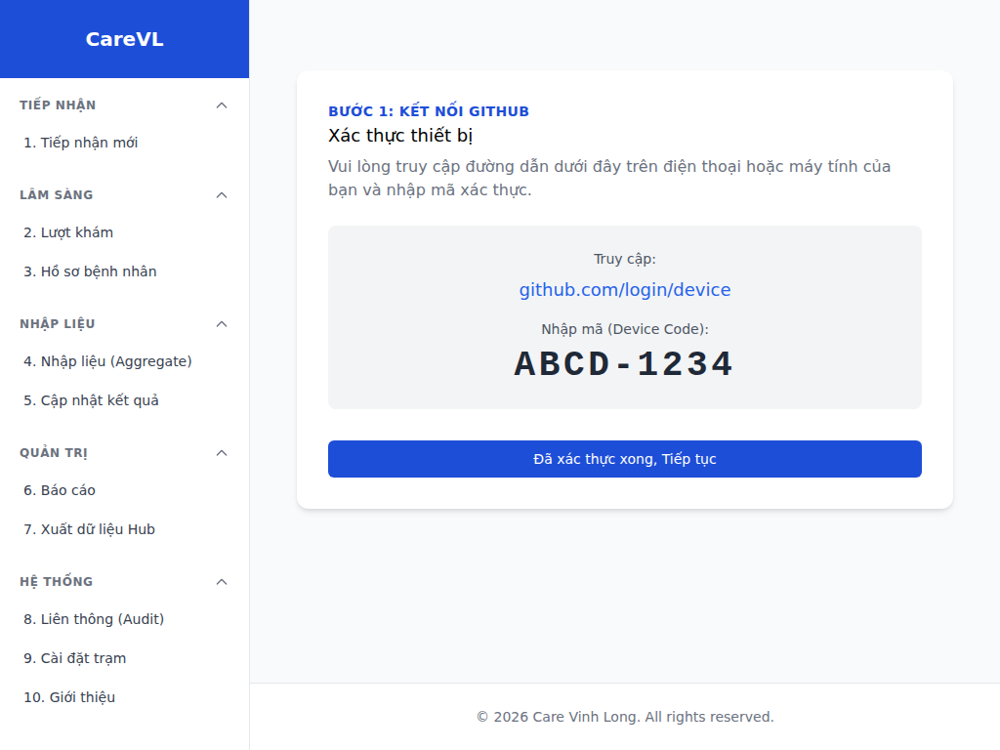
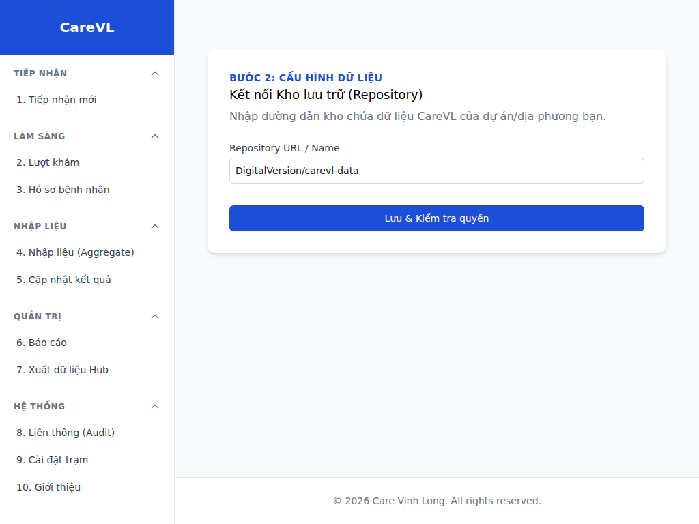
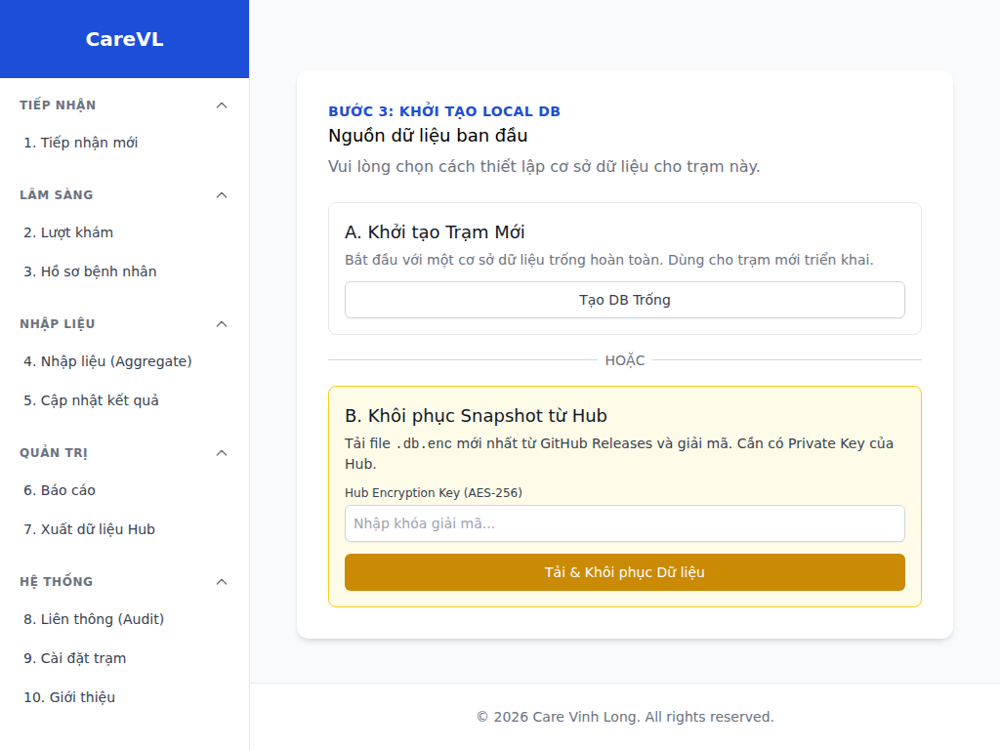
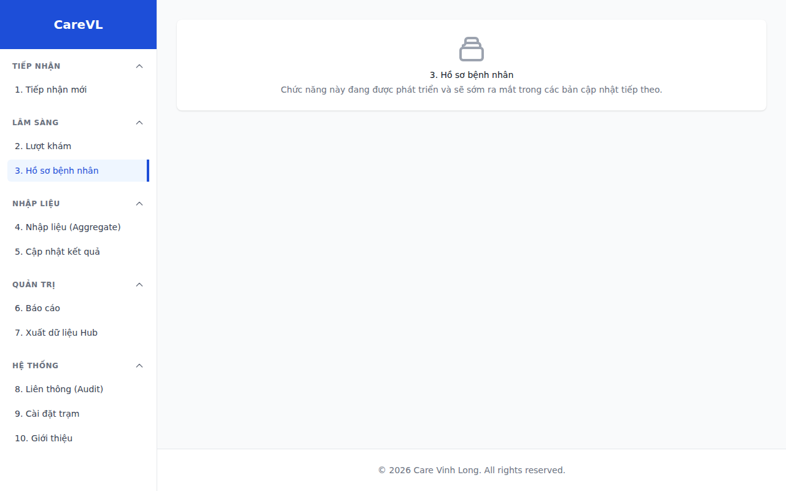
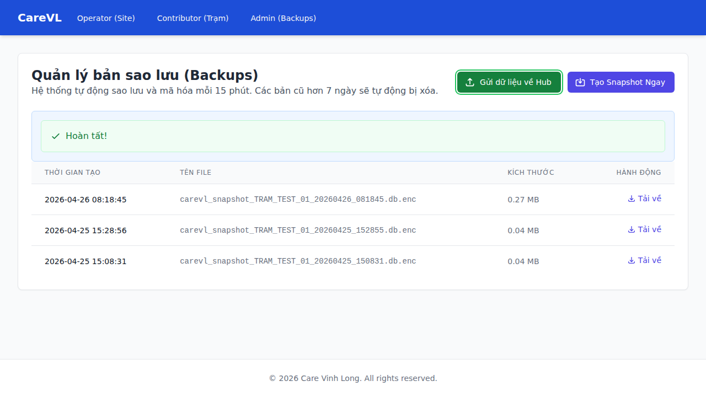

# Sổ tay Vận hành CareVL (Visual Tutorial - Windows Edition)

Tài liệu này hướng dẫn chi tiết quy trình cài đặt và sử dụng hệ thống CareVL dành riêng cho môi trường Windows tại các trạm y tế / đoàn khám lưu động.

---

## PHẦN 0: CÀI ĐẶT HỆ THỐNG TRÊN WINDOWS

Hệ thống CareVL được thiết kế để cài đặt "Zero-Config" trên Windows.
**Bước 1:** Nhấn tổ hợp phím `Win + X` trên bàn phím.
**Bước 2:** Chọn "Windows PowerShell (Admin)" hoặc "Terminal (Admin)" từ menu hiện ra.
**Bước 3:** Copy và Paste dòng lệnh cài đặt có trong file `README.md` vào màn hình đen/xanh của PowerShell và nhấn Enter.
**Bước 4:** Chờ đợi script tự động chạy. Sau khi xong, hệ thống sẽ mở trình duyệt và bạn sẽ thấy biểu tượng `CareVL Vĩnh Long` ngoài Desktop để dùng cho những lần sau.

---

## PHẦN 1: KÍCH HOẠT HỆ THỐNG LẦN ĐẦU (THE GATEWAY)

Khi ứng dụng mới được cài đặt, bạn cần thực hiện 5 bước thiết lập ban đầu để sử dụng vĩnh viễn (bao gồm cả khi mất mạng internet).

### Bước 1: Xác thực GitHub (Thiết bị)
Hệ thống sử dụng GitHub để đồng bộ và phân quyền.
1. Dùng điện thoại mở trang `github.com/login/device`.
2. Đăng nhập tài khoản GitHub cá nhân của bạn.
3. Nhập mã code hiển thị trên màn hình máy tính vào điện thoại.

### Bước 2: Cấu hình Repository
Nhập đường dẫn kho dữ liệu (Repository) mà Hub/Trung tâm đã tạo cho bạn (VD: `DigitalVersion/carevl-data`).

### Bước 3: Cấp quyền Ghi (Dành cho Admin)
Nếu tài khoản của bạn chưa được cấp quyền Ghi (Write) vào Repository trên:
1. Màn hình sẽ hiện cảnh báo **Chưa Có Quyền Ghi!**.
2. Đưa **Mã QR** trên màn hình cho Trưởng trạm hoặc Admin Hub quét để mời bạn tham gia nhóm làm việc.
3. Chấp nhận lời mời qua email, sau đó bấm nút "Tôi đã được Admin cấp quyền".

### Bước 4: Khởi tạo Dữ liệu (Khu vực Cài đặt Nguy hiểm)
Bạn có 2 lựa chọn:
*   **Tạo DB Trống:** Dành cho trạm mới hoàn toàn, chưa từng khám ai.
*   **Khôi phục Snapshot từ Hub:** Dùng khi cài lại máy. Bạn cần xin "Encryption Key" từ Hub để giải mã file dự phòng.

### Bước 5: Thiết lập Mã PIN (Đăng nhập Offline)
Tạo 1 mã PIN 6 số. Mã này dùng để mở khóa hệ thống hàng ngày mà không cần mạng Internet. **Tuyệt đối không quên mã PIN này.** Token truy cập sẽ được mã hoá bằng mã PIN của bạn.

---

## PHẦN 2: THAO TÁC THEO PERSONAS (SAU KHI ĐĂNG NHẬP)

Hệ thống cung cấp một Menu (Sidebar) với 10 chức năng. Thanh menu này sẽ ẩn/hiện tự động trên màn hình điện thoại.

### 1. Persona A: Tiếp nhận
**Vai trò:** Người đứng ở quầy đón bệnh nhân, quét thẻ CCCD và phát mã vạch (Sticker).
**Thao tác:** Chọn mục **1. Tiếp nhận mới** trên Sidebar.
*(Giao diện Sidebar - Mục Tiếp nhận mới)*

### 2. Persona B: Lâm sàng (Bác sĩ / Điều dưỡng)
**Vai trò:** Khám bệnh trực tiếp, đo sinh hiệu.
Các chức năng liên quan:
*   **2. Lượt khám:** Xem danh sách bệnh nhân đang chờ trước cửa phòng.
*   **3. Hồ sơ bệnh nhân:** Ghi nhận Huyết áp, Nhịp tim, Nhiệt độ trực tiếp vào hồ sơ.

### 3. Persona C: Cập nhật Kết quả (Nhập liệu)
**Vai trò:** Nhân viên phòng Lab cập nhật các xét nghiệm trả chậm và quản lý dữ liệu tổng hợp.
Các chức năng liên quan:
*   **4. Nhập liệu (Aggregate):** Dành cho việc nhập các số liệu thống kê tổng hợp (VD: MeasureReport) không gắn liền với một bệnh nhân cụ thể.
*   **5. Cập nhật kết quả:** Cập nhật kết quả xét nghiệm, chẩn đoán hình ảnh trả chậm (VD: DiagnosticReport) dựa trên mã vạch/CCCD.
*(Giao diện Sidebar - Mục Cập nhật kết quả)*

### 4. Persona D: Trưởng Trạm / Quản lý (Admin)
**Vai trò:** Quản lý số liệu, xuất báo cáo, đồng bộ dữ liệu về Hub và thiết lập hệ thống.
Các chức năng liên quan:
*   **6. Báo cáo:** Xem và xuất các báo cáo thống kê tình hình khám chữa bệnh tại trạm, báo cáo dịch tễ học hằng ngày/tuần.
*   **7. Xuất dữ liệu Hub:** Đóng gói, mã hoá an toàn dữ liệu nội bộ SQLite thành Snapshot và gửi lên GitHub Releases. *(Giao diện Admin Backups)* 
*   **8. Liên thông (Audit):** Kiểm tra trạng thái liên thông dữ liệu lên các hệ thống y tế quốc gia, xem nhật ký đồng bộ và lỗi phát sinh.
*   **9. Cài đặt trạm:** Cấu hình các thông số cơ bản của trạm (Tên trạm, Mã định danh SITE_ID, thay đổi mã PIN).
*   **10. Giới thiệu:** Thông tin về phiên bản phần mềm CareVL, bản quyền và hướng dẫn hỗ trợ kỹ thuật.
