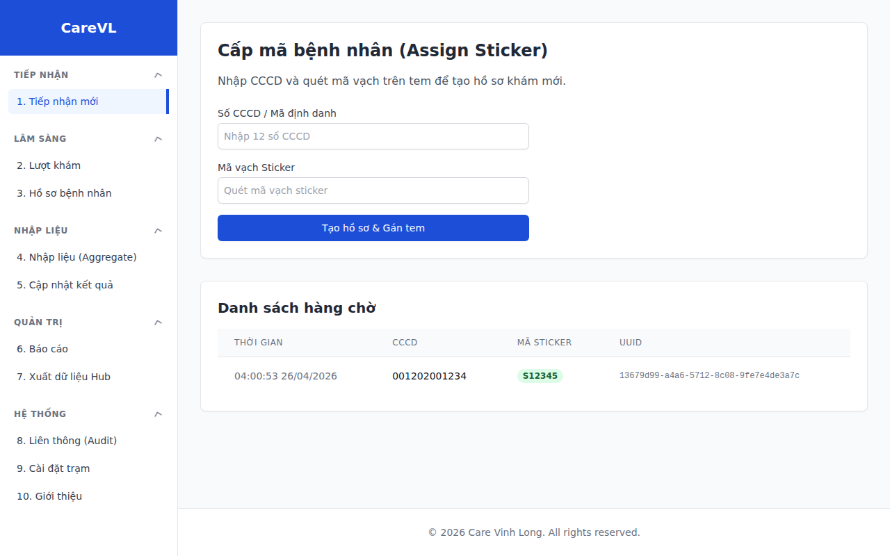
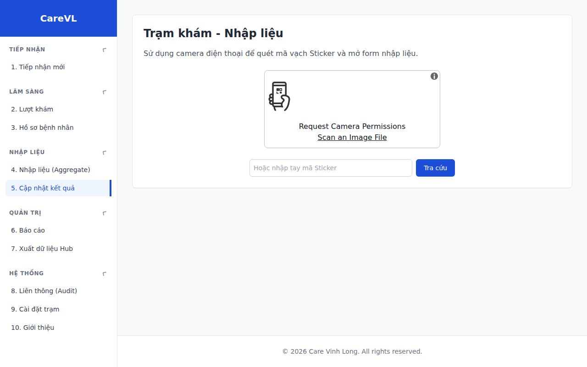

# Sổ tay Vận hành CareVL (Visual Tutorial)

Tài liệu này hướng dẫn chi tiết quy trình kích hoạt hệ thống lần đầu (Gateway) và cách sử dụng ứng dụng CareVL dựa trên 4 vai trò (Personas) chính trong trạm y tế / đoàn khám.

---

## PHẦN 1: KÍCH HOẠT HỆ THỐNG LẦN ĐẦU (THE GATEWAY)

Khi ứng dụng mới được cài đặt, bạn cần thực hiện 5 bước thiết lập ban đầu.

### Bước 1: Xác thực GitHub (Thiết bị)
Hệ thống sử dụng GitHub để đồng bộ và phân quyền.
1. Dùng điện thoại mở trang `github.com/login/device`.
2. Đăng nhập tài khoản GitHub cá nhân của bạn.
3. Nhập mã code hiển thị trên màn hình máy tính vào điện thoại.

### Bước 2: Cấu hình Repository
Nhập đường dẫn kho dữ liệu (Repository) mà Hub/Trung tâm đã tạo cho bạn (VD: `DigitalVersion/carevl-data`).

### Bước 3: Cấp quyền Ghi (Dành cho Admin)
Nếu tài khoản của bạn chưa được cấp quyền Ghi (Write) vào Repository trên:
1. Màn hình sẽ hiện cảnh báo **Chưa Có Quyền Ghi!**.
2. Đưa **Mã QR** trên màn hình cho Trưởng trạm hoặc Admin Hub quét để mời bạn tham gia nhóm làm việc.
3. Chấp nhận lời mời qua email, sau đó bấm nút "Tôi đã được Admin cấp quyền".

### Bước 4: Khởi tạo Dữ liệu
Bạn có 2 lựa chọn:
*   **Tạo DB Trống:** Dành cho trạm mới hoàn toàn, chưa từng khám ai.
*   **Khôi phục Snapshot từ Hub:** Dùng khi cài lại máy. Bạn cần xin "Encryption Key" từ Hub để giải mã file dự phòng.

### Bước 5: Thiết lập Mã PIN (Đăng nhập Offline)
Tạo 1 mã PIN 6 số. Mã này dùng để mở khóa hệ thống hàng ngày mà không cần mạng Internet. **Tuyệt đối không quên mã PIN này.**

---

## PHẦN 2: THAO TÁC THEO PERSONAS (SAU KHI ĐĂNG NHẬP)

Hệ thống cung cấp một Menu (Sidebar) với 10 chức năng, được thiết kế theo chuẩn FHIR. Thanh menu này sẽ ẩn/hiện tự động trên màn hình điện thoại.

### 1. Persona A: Tiếp nhận
**Vai trò:** Người đứng ở quầy đón bệnh nhân, quét thẻ CCCD và phát mã vạch (Sticker).
**Thao tác:**
1. Chọn mục **1. Tiếp nhận mới** trên Sidebar.
2. Quét hoặc nhập số CCCD của bệnh nhân.
3. Quét mã vạch trên tờ tem nhãn (Sticker ID).
4. Bấm "Phát tem & Xếp hàng".

*(Giao diện Sidebar - Mục Tiếp nhận mới)*

---

### 2. Persona B: Lâm sàng (Bác sĩ / Điều dưỡng)
**Vai trò:** Khám bệnh trực tiếp, đo sinh hiệu.

*(Tính năng hiện đang trong quá trình phát triển - Coming Soon)*

Các chức năng sắp ra mắt:
*   **2. Lượt khám:** Xem danh sách bệnh nhân đang chờ trước cửa phòng.
*   **3. Hồ sơ bệnh nhân:** Ghi nhận Huyết áp, Nhịp tim, Nhiệt độ trực tiếp vào hồ sơ.

---

### 3. Persona C: Cập nhật Kết quả (Nhập liệu)
**Vai trò:** Nhân viên phòng Lab hoặc người trực cập nhật các xét nghiệm trả chậm (Cận lâm sàng, X-Quang).
**Thao tác:**
1. Mở điện thoại, chọn mục **5. Cập nhật kết quả**.
2. Dùng camera điện thoại quét mã vạch trên phiếu kết quả (Sticker ID).
3. Nhập các chỉ số bổ sung.
4. Bấm Lưu.

*(Giao diện Sidebar - Mục Cập nhật kết quả)*

---

### 4. Persona D: Trưởng Trạm / Quản lý (Admin)
**Vai trò:** Quản lý số liệu, xuất báo cáo và đồng bộ dữ liệu về Trung tâm (Hub).
**Thao tác Đồng bộ:**
1. Chọn mục **7. Xuất dữ liệu Hub**.
2. Hệ thống sẽ tự động sao lưu dữ liệu mỗi 15 phút.
3. Bạn có thể bấm "Tạo Snapshot Ngay" để sao lưu tức thì.
4. Bấm "Gửi dữ liệu về Hub" để tải gói dữ liệu bảo mật lên hệ thống trung tâm.

*(Giao diện Admin Backups - Active Sync)*
